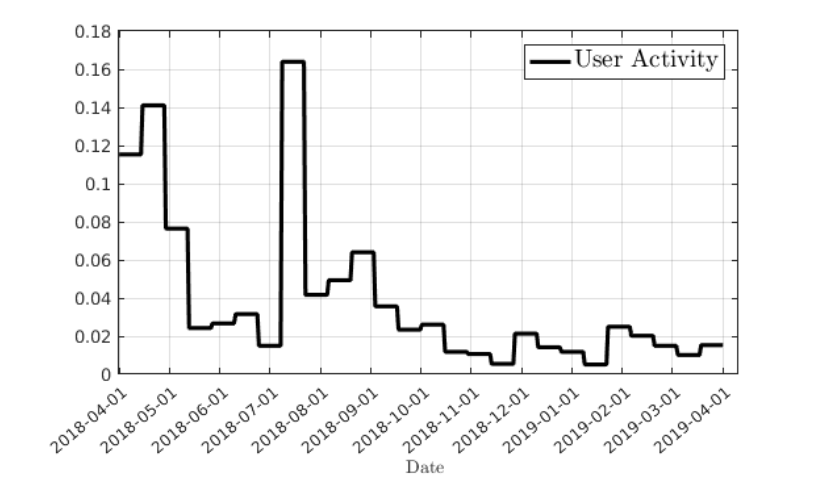

# Probabilistic Topic Modeling over Time for Online Social Media Trends

Implementation of the probabilistic topic modeling with categorical time distribution for Twitter, published in Proceedings of the 31st ACM Conference on Hypertext and Social Media:

Please Cite:
@inproceedings{oghaz2020probabilistic,
  title={Probabilistic model of narratives over topical trends in social media: A discrete time model},
  author={Oghaz, Toktam A and Mutlu, Ece {\c{C}}i{\u{g}}dem and Jasser, Jasser and Yousefi, Niloofar and Garibay, Ivan},
  booktitle={Proceedings of the 31st ACM Conference on Hypertext and Social Media},
  pages={281--290},
  year={2020}
}

## Requirements

The model is a modified version of TOT. If you are interested, the original model can be found [here.](https://github.com/ahmaurya/topics_over_time). The code is tested on:
- Python 3.6

### Dataset
For our paper, the dataset was provided to us as part of the Computational Simulation of Online Social Behavior ([SocialSim](https://www.darpa.mil/program/computational-simulation-of-online-social-behavior)) program initiated by the Defense Advanced Research Projects Agency (DARPA). But, similar dataset can be downloaded from the tweeter API with keyword and/or hashtag query for a specific domain. Our dataset contains tweets on the domain of White Helmets of Syria over a period of 13 month from April 2018 to April 2019. We analyzed more than 1,052,000 tweets. 

### Model

### Results
The distribution of identified topics is depicted below. 

  

The interesting thing about the model is that the distribution of the topics that are identified with this method mimic the distribution of user activity fluctuations in the social media data. The activity fluctuations has been depicted below as a distribution for comparison. 

